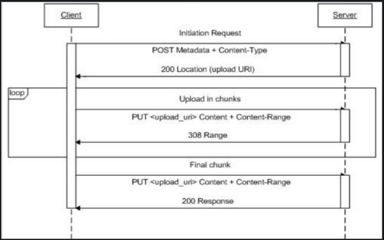

Direct upload helps you upload content using authenticated upload URL.
You can use the authenticated upload URL in order to upload your content from different clients, such as browsers, mobile apps, or command-line tools, depends on your business use-cases.

[Swagger-API documentation](https://ugc-api-swagger.k8s-rc-101.it.megogo.dev/)

Let's start by walking through several steps:

**1. Create an authenticated upload URL**

In order to create an upload URL you need to provide only two mandatory headers:

* _User-Id (string)_
* _Token (string)_

curl example:

```bash
curl --location
   --request POST 'https://ugc-api.k8s-rc-101.it.megogo.dev/v1/uploads'
   --header 'Content-Type: application/json'
   --header 'User-Id: $USER_ID'
   --header 'Token: $TOKEN'
```

And body, but it's optionally, we will see later on how to use it

```json
{
   "callback": "string",
   "new_asset_settings": {
       "passthrough": "string",
       "input": [{"name": "string" } ]
   }
}
````

The same curl example with body:

```bash
curl --location
   --request POST 'https://ugc-api.k8s-rc-101.it.megogo.dev/v1/uploads'
   --header 'Content-Type: application/json'
   --header 'User-Id: $USER_ID'
   --header 'Token: $TOKEN'
   -d '{ 
           "callback": "$YOUR_APP_CALLBACK_URL", 
           "new_asset_settings": { 
               "passthrough": "my custom information", 
               "input": [{"name": video.mp4}] 
           }
        }'
```

Example response:

```json
{
   "data": {
      "id": "60a61970dd6b25720348dd21",
      "url": "AUTHENTICATED_UPLOAD_URL",
      "status": "asset_created",
      "asset_id": "60a6196ec210874c3d3c965b",
      "error": {}
   }
}
````

**2. Use that authenticated upload URL**

After the successful creation of an authenticated upload URL you can make PUT requests to upload content.
The URL is resumable, which means if it's a really large file you can send your file in chunks and pause/resume at will.

curl example:

```bash
curl -v --location --request PUT '$AUTHENTICATED_UPLOAD_URL_FROM_STEP_ONE'
   --header 'Content-Type: application/binary'
   --data-binary '@/home/user/my_awesome_video.mp4'
```

It will respond with 200 OK when the upload is completed. Note that the maximum file size should be up to 64 MB

In case if you are willing to upload big files by chunks or implement resumable upload split the file into chunks that are a multiple of 256KB (256, 1024 bytes).
For example, if you wanted to have 10MB chunks, you'd want each one to be 10,485,760 bytes (10 * 1024 * 1024).
The exception is the final chunk, which can just be the remainder of the file.

Set a couple of headers:

* _Content-Type_: the type of the content you're uploading.
* _Content-Range_: what bytes you're currently uploading. For example, if you've got a 100MB file and you're uploading in ~10MB chunks, this header would look like Content-Range: bytes 0-10485760/100000000 for the first chunk.
Now use a PUT request like we were for "normal" uploads, just with those additional headers and each individual chunk as the body.
If the server responds with a 308, you're good to continue uploading! It will respond with 200 OK when the upload is completed.

Please follow the diagram:



Take a look at library https://github.com/muxinc/upchunk for more details about implementing resumable upload

**3. Check results**

By now you are ready to check your asset and playback

An asset refers to a piece of media content that is stored. The media content of an asset cannot be updated once created.

curl example:

```bash
curl --location --request GET 'https://ugc-api.k8s-rc-101.it.megogo.dev/v1/assets'
   --header 'Content-Type: application/json'
   --header 'User-Id: $USER_ID'
   --header 'Token: $TOKEN'
```

Example response:

```json
{
   "data": [
      {
         "size": 56879839,
         "format": "mkv",
         "id": "60a64bd6e425814ff88a8557",
         "created_at": "1621511125987",
         "status": "ready",
         "duration": 600.003,
         "aspect_ratio": "4:3",
         "playback_ids": [
         {
            "id": "60a64bd6cd8c7d6be22af96b",
            "policy": "public"
         }
         ],
         "tracks": [
            {
               "type": "video",
               "max_width": 720,
               "max_height": 608,
               "name": "h264"
            },
            {
               "type": "audio",
               "language_code": "rus",
               "max_channels": 2,
               "max_channel_layout": "stereo",
               "name": "vorbis"
            }
         ],
         "passthrough": "test",
         "download_url": "http://example_download_link"
      }
   ]
}
```

A playback refers to a piece of media content that is being streamed through the system.

curl example:

```bash
curl --location --request GET 'https://ugc-api.k8s-rc-101.it.megogo.dev/v1/playbacks/$PLAYBACK_ID_FROM_ASSET_RESPONSE'
   --header 'Content-Type: application/json'
   --header 'User-Id: $USER_ID'
   --header 'Token: $TOKEN'
```

Example response:

```json
{
   "id": "60a64bd6cd8c7d6be22af96b",
   "asset_id": "60a64bd6e425814ff88a8557",
   "encode_status": "Task completed",
   "streaming_links": {
      "hls": "http://example_hls_streaming_link/playlist.m3u8",
      "mpd": "http://example_mpd_streaming_link/manifest.mpd",
      "ss": "http://example_ss_streaming_link/Manifest"
   },
   "preview": "http://example_download_link/3000999751.jpg"
}
```
It provides you with several useful links for your business needs:

* _streaming_links_ - for streaming your content
* _preview_ - preview picture

**4. Listen for webhooks**

Note that the parameter callback will provide you a convenient notification mechanism from the platform about changes, using the PUSH approach.
We will submit a POST request to the configured URL, which your application can treat the same as any other route.
Your event handler can do things like update the state of the specified asset, upload, etc.

List of supported webhook types:

* Asset Events:
  * _video.asset.created_: As asset has been created
  * _video.asset.ready_: An asset is ready for playback
  * _video.asset.errored_: An asset has errored. Use this to notify your server about errored assets
  * _video.asset.deleted_: An asset has been deleted
* Upload Events:
  * _video.upload.cancelled_: Upload has been canceled
  * _video.upload.created_: Upload has been created
  * _video.upload.errored_: Upload has errored. This event fires when the asset created by the direct upload fails
* Playback:
  * _playback.created_: You can now use the asset's playback_id to successfully start streaming this asset

Example response:

```json
{
   "type": "video.asset.ready",
   "id": "60a7717d1fd7ee12f3386803",
   "created_at": "2021-05-21T08:38:21.866800Z",
   "object": {
      "type": "asset",
      "id": "60a770ac770f3e0850446116"
   },
   "data": {
      "id": "60a770ac770f3e0850446116",
      "callback": "$YOUR_APP_CALLBACK_URL",
      "user_id": "1064d47f-6d28-41b4-bf2e-d25d84acd473",
      "created_at": "1621586092191",
      "status": "ready",
      "size": 56879839,
      "format": "MKV",
      "duration": 600.003,
      "aspect_ratio": "4:3",
      "tracks": [
         {
            "type": "video",
            "max_width": 720,
            "max_height": 608,
            "name": "h264"
         },
         {
            "type": "audio",
            "language_code": "rus",
            "max_channels": 2,
            "max_channel_layout": "stereo",
            "name": "vorbis"
         }
      ],
      "passthrough": "test",
      "playback_ids": [
         {
            "id": "60a770ac0558a259286d2fde",
            "policy": "public"
         }
      ]
   },
   "attempts": [
      {
         "id": "60a7717d1fd7ee12f3386804",
         "created_at": "2021-05-21T08:38:21.874699Z",
         "address": "$YOUR_APP_CALLBACK_URL",
         "webhook_id": "60a7717d1fd7ee12f3386803",
         "max_attempts": 30
      }
   ]
}
```

Keep going and dive into [Swagger-API documentation](https://ugc-api-swagger.k8s-rc-101.it.megogo.dev/)
